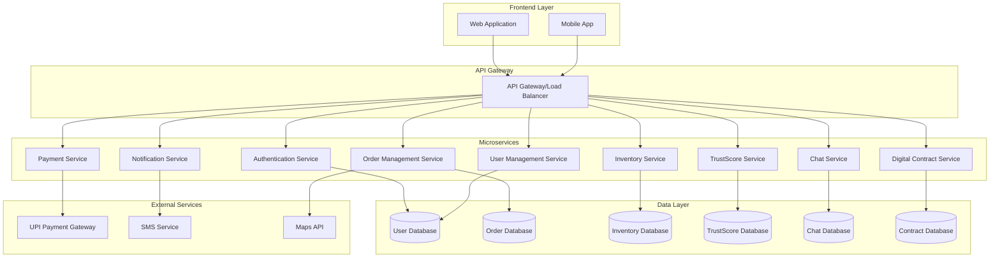

# Design Document

## Overview

The Vendor-Supplier Platform is a web-based marketplace application designed to connect street food vendors with raw material suppliers in India. The system employs a microservices architecture with real-time capabilities, digital contract management, and a sophisticated trust scoring algorithm. The platform supports role-based access, automated supplier matching, order tracking, and integrated payment processing.

## Architecture

### High-Level Architecture



### Technology Stack

- **Frontend**: React.js with TypeScript, Redux for state management
- **Backend**: Node.js with Express.js framework
- **Database**: PostgreSQL for transactional data, Redis for caching and real-time features
- **Authentication**: JWT tokens with refresh token mechanism
- **Real-time Communication**: Socket.io for chat and notifications
- **Payment Integration**: UPI payment gateway APIs
- **File Storage**: AWS S3 or similar for contract documents and invoices
- **Deployment**: Docker containers with Kubernetes orchestration

## Components and Interfaces

### 1. Authentication Service

**Purpose**: Handles user registration, login, and role-based access control

**Key Components**:
- User registration with role selection (vendor/supplier)
- JWT token generation and validation
- Password reset and account verification
- Role-based middleware for API protection

**API Endpoints**:
```
POST /auth/register
POST /auth/login
POST /auth/refresh-token
POST /auth/forgot-password
POST /auth/verify-account
```

### 2. User Management Service

**Purpose**: Manages user profiles, business information, and preferences

**Key Components**:
- User profile management
- Business details storage (location, type, contact info)
- Preference settings
- Account status management

**API Endpoints**:
```
GET /users/profile
PUT /users/profile
GET /users/{userId}/public-profile
PUT /users/preferences
```

### 3. Order Management Service

**Purpose**: Handles order creation, tracking, and lifecycle management

**Key Components**:
- Order creation and validation
- Supplier matching algorithm
- Order status tracking
- Recurring order scheduling
- Order history and analytics

**API Endpoints**:
```
POST /orders
GET /orders
GET /orders/{orderId}
PUT /orders/{orderId}/status
POST /orders/recurring
GET /orders/recurring
```

### 4. Inventory Service

**Purpose**: Manages supplier inventory, pricing, and availability

**Key Components**:
- Product catalog management
- Real-time inventory tracking
- Price management
- Low-stock alerts
- Category management (vegetables, grains, spices, dairy)

**API Endpoints**:
```
GET /inventory/products
POST /inventory/products
PUT /inventory/products/{productId}
GET /inventory/categories
PUT /inventory/{productId}/stock
```

### 5. TrustScore Service

**Purpose**: Calculates and manages trust scores for vendors and suppliers

**Key Components**:
- Trust score calculation engine
- Historical score tracking
- Score factor analysis
- Ranking algorithms
- Score transparency dashboard

**Trust Score Algorithm**:
```javascript
// Supplier TrustScore Calculation
supplierScore = (
  onTimeDeliveryRate * 0.35 +
  averageVendorRating * 0.25 +
  pricingCompetitiveness * 0.20 +
  orderFulfillmentRate * 0.20
) * 100

// Vendor TrustScore Calculation
vendorScore = (
  paymentTimeliness * 0.40 +
  orderConsistency * 0.30 +
  platformEngagement * 0.30
) * 100
```

**API Endpoints**:
```
GET /trust/score/{userId}
GET /trust/history/{userId}
POST /trust/update-factors
GET /trust/rankings
```

### 6. Digital Contract Service

**Purpose**: Manages digital contract creation, signing, and storage

**Key Components**:
- Contract template management
- Digital signature integration
- Contract versioning
- Legal compliance tracking
- Contract analytics

**API Endpoints**:
```
POST /contracts
GET /contracts/{contractId}
POST /contracts/{contractId}/sign
GET /contracts/templates
PUT /contracts/{contractId}/status
```

### 7. Payment Service

**Purpose**: Handles payment processing, tracking, and reminders

**Key Components**:
- UPI payment integration
- Invoice upload and processing
- Payment reminder system
- Payment history tracking
- Dispute management

**API Endpoints**:
```
POST /payments/initiate
POST /payments/verify
POST /payments/invoice-upload
GET /payments/history
POST /payments/mark-paid
```

### 8. Chat Service

**Purpose**: Provides real-time communication between vendors and suppliers

**Key Components**:
- Real-time messaging with Socket.io
- Message history storage
- File sharing capabilities
- Order-specific chat rooms
- Message notifications

**Socket Events**:
```
join_order_chat
send_message
receive_message
typing_indicator
file_upload
```

### 9. Notification Service

**Purpose**: Manages all platform notifications and alerts

**Key Components**:
- SMS notifications for critical updates
- In-app notifications
- Email notifications
- Push notifications for mobile
- Notification preferences management

**API Endpoints**:
```
POST /notifications/send
GET /notifications
PUT /notifications/{notificationId}/read
PUT /notifications/preferences
```

## Data Models

### User Model
```typescript
interface User {
  id: string;
  name: string;
  mobile: string;
  email?: string;
  role: 'vendor' | 'supplier';
  location: {
    address: string;
    city: string;
    state: string;
    pincode: string;
    coordinates: {
      lat: number;
      lng: number;
    };
  };
  businessType: string;
  trustScore: number;
  isActive: boolean;
  createdAt: Date;
  updatedAt: Date;
}
```

### Order Model
```typescript
interface Order {
  id: string;
  vendorId: string;
  supplierId: string;
  items: OrderItem[];
  totalAmount: number;
  status: 'pending' | 'accepted' | 'in_progress' | 'out_for_delivery' | 'delivered' | 'cancelled';
  orderType: 'one_time' | 'recurring';
  recurringConfig?: RecurringConfig;
  deliveryAddress: Address;
  estimatedDeliveryTime?: Date;
  actualDeliveryTime?: Date;
  contractId?: string;
  createdAt: Date;
  updatedAt: Date;
}

interface OrderItem {
  productId: string;
  productName: string;
  quantity: number;
  unit: string;
  pricePerUnit: number;
  totalPrice: number;
}
```

### Product Model
```typescript
interface Product {
  id: string;
  supplierId: string;
  name: string;
  category: 'vegetables' | 'grains' | 'spices' | 'dairy' | 'other';
  description: string;
  unit: string;
  pricePerUnit: number;
  stockQuantity: number;
  minOrderQuantity: number;
  isAvailable: boolean;
  images: string[];
  createdAt: Date;
  updatedAt: Date;
}
```

### Digital Contract Model
```typescript
interface DigitalContract {
  id: string;
  orderId: string;
  vendorId: string;
  supplierId: string;
  terms: {
    deliveryTimeline: string;
    quantities: OrderItem[];
    totalCost: number;
    paymentDeadline: Date;
    qualityStandards: string;
    cancellationPolicy: string;
  };
  vendorSignature?: {
    signedAt: Date;
    ipAddress: string;
    deviceInfo: string;
  };
  supplierSignature?: {
    signedAt: Date;
    ipAddress: string;
    deviceInfo: string;
  };
  status: 'draft' | 'pending_vendor_signature' | 'pending_supplier_signature' | 'signed' | 'cancelled';
  createdAt: Date;
  updatedAt: Date;
}
```

### TrustScore Model
```typescript
interface TrustScore {
  userId: string;
  currentScore: number;
  factors: {
    onTimeDelivery?: number;
    customerRating?: number;
    pricingCompetitiveness?: number;
    orderFulfillment?: number;
    paymentTimeliness?: number;
    orderConsistency?: number;
    platformEngagement?: number;
  };
  history: TrustScoreHistory[];
  lastUpdated: Date;
}

interface TrustScoreHistory {
  score: number;
  factors: object;
  reason: string;
  timestamp: Date;
}
```

## Error Handling

### Error Response Format
```typescript
interface ErrorResponse {
  success: false;
  error: {
    code: string;
    message: string;
    details?: any;
    timestamp: Date;
  };
}
```

### Error Categories

1. **Authentication Errors** (401)
   - Invalid credentials
   - Expired tokens
   - Insufficient permissions

2. **Validation Errors** (400)
   - Missing required fields
   - Invalid data formats
   - Business rule violations

3. **Resource Errors** (404)
   - User not found
   - Order not found
   - Product not found

4. **Business Logic Errors** (422)
   - Insufficient inventory
   - Invalid order state transitions
   - Contract signing conflicts

5. **External Service Errors** (503)
   - Payment gateway failures
   - SMS service unavailable
   - Maps API errors

### Error Handling Strategy

- Implement circuit breaker pattern for external services
- Use retry mechanisms with exponential backoff
- Log all errors with correlation IDs for tracing
- Provide user-friendly error messages
- Implement graceful degradation for non-critical features

## Testing Strategy

### Unit Testing
- Test individual service functions and methods
- Mock external dependencies
- Achieve minimum 80% code coverage
- Use Jest for JavaScript/TypeScript testing

### Integration Testing
- Test API endpoints with real database connections
- Test service-to-service communication
- Use test containers for database testing
- Validate data flow between components

### End-to-End Testing
- Test complete user workflows
- Automate critical user journeys
- Use Cypress or Playwright for web testing
- Test mobile app flows with Appium

### Performance Testing
- Load testing for concurrent users
- Stress testing for peak traffic
- Database performance optimization
- API response time monitoring

### Security Testing
- Authentication and authorization testing
- Input validation and sanitization
- SQL injection and XSS prevention
- Payment security compliance testing

### Test Data Management
- Create realistic test datasets
- Implement data seeding scripts
- Use factories for test data generation
- Maintain separate test environments

### Monitoring and Observability
- Application performance monitoring (APM)
- Real-time error tracking
- Business metrics dashboards
- User behavior analytics
- Infrastructure monitoring

## Database Schema

### Complete PostgreSQL Schema

```sql
-- Users table
CREATE TABLE users (
    id UUID PRIMARY KEY DEFAULT gen_random_uuid(),
    name VARCHAR(255) NOT NULL,
    mobile VARCHAR(15) UNIQUE NOT NULL,
    email VARCHAR(255) UNIQUE,
    password_hash VARCHAR(255) NOT NULL,
    role VARCHAR(20) NOT NULL CHECK (role IN ('vendor', 'supplier')),
    business_type VARCHAR(100) NOT NULL,
    address TEXT NOT NULL,
    city VARCHAR(100) NOT NULL,
    state VARCHAR(100) NOT NULL,
    pincode VARCHAR(10) NOT NULL,
    latitude DECIMAL(10, 8),
    longitude DECIMAL(11, 8),
    is_active BOOLEAN DEFAULT true,
    is_verified BOOLEAN DEFAULT false,
    created_at TIMESTAMP DEFAULT CURRENT_TIMESTAMP,
    updated_at TIMESTAMP DEFAULT CURRENT_TIMESTAMP
);

-- Trust scores table
CREATE TABLE trust_scores (
    id UUID PRIMARY KEY DEFAULT gen_random_uuid(),
    user_id UUID NOT NULL REFERENCES users(id) ON DELETE CASCADE,
    current_score DECIMAL(5, 2) DEFAULT 50.00,
    on_time_delivery_rate DECIMAL(5, 2),
    customer_rating DECIMAL(3, 2),
    pricing_competitiveness DECIMAL(5, 2),
    order_fulfillment_rate DECIMAL(5, 2),
    payment_timeliness DECIMAL(5, 2),
    order_consistency DECIMAL(5, 2),
    platform_engagement DECIMAL(5, 2),
    total_orders INTEGER DEFAULT 0,
    successful_orders INTEGER DEFAULT 0,
    last_updated TIMESTAMP DEFAULT CURRENT_TIMESTAMP,
    UNIQUE(user_id)
);

-- Trust score history table
CREATE TABLE trust_score_history (
    id UUID PRIMARY KEY DEFAULT gen_random_uuid(),
    user_id UUID NOT NULL REFERENCES users(id) ON DELETE CASCADE,
    score DECIMAL(5, 2) NOT NULL,
    factors JSONB,
    reason TEXT,
    created_at TIMESTAMP DEFAULT CURRENT_TIMESTAMP
);

-- Product categories table
CREATE TABLE product_categories (
    id UUID PRIMARY KEY DEFAULT gen_random_uuid(),
    name VARCHAR(100) NOT NULL UNIQUE,
    description TEXT,
    is_active BOOLEAN DEFAULT true,
    created_at TIMESTAMP DEFAULT CURRENT_TIMESTAMP
);

-- Products table
CREATE TABLE products (
    id UUID PRIMARY KEY DEFAULT gen_random_uuid(),
    supplier_id UUID NOT NULL REFERENCES users(id) ON DELETE CASCADE,
    category_id UUID NOT NULL REFERENCES product_categories(id),
    name VARCHAR(255) NOT NULL,
    description TEXT,
    unit VARCHAR(50) NOT NULL,
    price_per_unit DECIMAL(10, 2) NOT NULL,
    stock_quantity INTEGER DEFAULT 0,
    min_order_quantity INTEGER DEFAULT 1,
    max_order_quantity INTEGER,
    is_available BOOLEAN DEFAULT true,
    images TEXT[],
    created_at TIMESTAMP DEFAULT CURRENT_TIMESTAMP,
    updated_at TIMESTAMP DEFAULT CURRENT_TIMESTAMP
);

-- Orders table
CREATE TABLE orders (
    id UUID PRIMARY KEY DEFAULT gen_random_uuid(),
    vendor_id UUID NOT NULL REFERENCES users(id) ON DELETE CASCADE,
    supplier_id UUID REFERENCES users(id) ON DELETE SET NULL,
    order_number VARCHAR(50) UNIQUE NOT NULL,
    status VARCHAR(30) NOT NULL DEFAULT 'pending' 
        CHECK (status IN ('pending', 'accepted', 'in_progress', 'out_for_delivery', 'delivered', 'cancelled')),
    order_type VARCHAR(20) NOT NULL DEFAULT 'one_time' 
        CHECK (order_type IN ('one_time', 'recurring')),
    total_amount DECIMAL(12, 2) NOT NULL,
    delivery_address TEXT NOT NULL,
    delivery_city VARCHAR(100) NOT NULL,
    delivery_pincode VARCHAR(10) NOT NULL,
    delivery_latitude DECIMAL(10, 8),
    delivery_longitude DECIMAL(11, 8),
    estimated_delivery_time TIMESTAMP,
    actual_delivery_time TIMESTAMP,
    notes TEXT,
    created_at TIMESTAMP DEFAULT CURRENT_TIMESTAMP,
    updated_at TIMESTAMP DEFAULT CURRENT_TIMESTAMP
);

-- Order items table
CREATE TABLE order_items (
    id UUID PRIMARY KEY DEFAULT gen_random_uuid(),
    order_id UUID NOT NULL REFERENCES orders(id) ON DELETE CASCADE,
    product_id UUID NOT NULL REFERENCES products(id),
    product_name VARCHAR(255) NOT NULL,
    quantity INTEGER NOT NULL,
    unit VARCHAR(50) NOT NULL,
    price_per_unit DECIMAL(10, 2) NOT NULL,
    total_price DECIMAL(12, 2) NOT NULL,
    created_at TIMESTAMP DEFAULT CURRENT_TIMESTAMP
);

-- Recurring orders configuration
CREATE TABLE recurring_orders (
    id UUID PRIMARY KEY DEFAULT gen_random_uuid(),
    vendor_id UUID NOT NULL REFERENCES users(id) ON DELETE CASCADE,
    supplier_id UUID REFERENCES users(id) ON DELETE SET NULL,
    frequency VARCHAR(20) NOT NULL DEFAULT 'monthly',
    next_order_date DATE NOT NULL,
    is_active BOOLEAN DEFAULT true,
    reminder_sent BOOLEAN DEFAULT false,
    template_data JSONB NOT NULL,
    created_at TIMESTAMP DEFAULT CURRENT_TIMESTAMP,
    updated_at TIMESTAMP DEFAULT CURRENT_TIMESTAMP
);

-- Digital contracts table
CREATE TABLE digital_contracts (
    id UUID PRIMARY KEY DEFAULT gen_random_uuid(),
    order_id UUID NOT NULL REFERENCES orders(id) ON DELETE CASCADE,
    vendor_id UUID NOT NULL REFERENCES users(id),
    supplier_id UUID NOT NULL REFERENCES users(id),
    contract_number VARCHAR(50) UNIQUE NOT NULL,
    terms JSONB NOT NULL,
    status VARCHAR(30) NOT NULL DEFAULT 'draft'
        CHECK (status IN ('draft', 'pending_vendor_signature', 'pending_supplier_signature', 'signed', 'cancelled')),
    vendor_signed_at TIMESTAMP,
    vendor_signature_data JSONB,
    supplier_signed_at TIMESTAMP,
    supplier_signature_data JSONB,
    created_at TIMESTAMP DEFAULT CURRENT_TIMESTAMP,
    updated_at TIMESTAMP DEFAULT CURRENT_TIMESTAMP
);

-- Payments table
CREATE TABLE payments (
    id UUID PRIMARY KEY DEFAULT gen_random_uuid(),
    order_id UUID NOT NULL REFERENCES orders(id) ON DELETE CASCADE,
    vendor_id UUID NOT NULL REFERENCES users(id),
    supplier_id UUID NOT NULL REFERENCES users(id),
    amount DECIMAL(12, 2) NOT NULL,
    payment_method VARCHAR(50) NOT NULL,
    payment_status VARCHAR(30) NOT NULL DEFAULT 'pending'
        CHECK (payment_status IN ('pending', 'processing', 'completed', 'failed', 'refunded')),
    transaction_id VARCHAR(255),
    payment_gateway_response JSONB,
    due_date DATE NOT NULL,
    paid_at TIMESTAMP,
    invoice_url TEXT,
    created_at TIMESTAMP DEFAULT CURRENT_TIMESTAMP,
    updated_at TIMESTAMP DEFAULT CURRENT_TIMESTAMP
);

-- Chat rooms table
CREATE TABLE chat_rooms (
    id UUID PRIMARY KEY DEFAULT gen_random_uuid(),
    order_id UUID NOT NULL REFERENCES orders(id) ON DELETE CASCADE,
    vendor_id UUID NOT NULL REFERENCES users(id),
    supplier_id UUID NOT NULL REFERENCES users(id),
    is_active BOOLEAN DEFAULT true,
    created_at TIMESTAMP DEFAULT CURRENT_TIMESTAMP
);

-- Chat messages table
CREATE TABLE chat_messages (
    id UUID PRIMARY KEY DEFAULT gen_random_uuid(),
    room_id UUID NOT NULL REFERENCES chat_rooms(id) ON DELETE CASCADE,
    sender_id UUID NOT NULL REFERENCES users(id),
    message_type VARCHAR(20) NOT NULL DEFAULT 'text'
        CHECK (message_type IN ('text', 'image', 'file')),
    content TEXT NOT NULL,
    file_url TEXT,
    file_name VARCHAR(255),
    file_size INTEGER,
    is_read BOOLEAN DEFAULT false,
    created_at TIMESTAMP DEFAULT CURRENT_TIMESTAMP
);

-- Notifications table
CREATE TABLE notifications (
    id UUID PRIMARY KEY DEFAULT gen_random_uuid(),
    user_id UUID NOT NULL REFERENCES users(id) ON DELETE CASCADE,
    title VARCHAR(255) NOT NULL,
    message TEXT NOT NULL,
    type VARCHAR(50) NOT NULL,
    data JSONB,
    is_read BOOLEAN DEFAULT false,
    sent_at TIMESTAMP DEFAULT CURRENT_TIMESTAMP,
    read_at TIMESTAMP
);

-- User preferences table
CREATE TABLE user_preferences (
    id UUID PRIMARY KEY DEFAULT gen_random_uuid(),
    user_id UUID NOT NULL REFERENCES users(id) ON DELETE CASCADE,
    email_notifications BOOLEAN DEFAULT true,
    sms_notifications BOOLEAN DEFAULT true,
    push_notifications BOOLEAN DEFAULT true,
    order_reminders BOOLEAN DEFAULT true,
    payment_reminders BOOLEAN DEFAULT true,
    marketing_emails BOOLEAN DEFAULT false,
    language VARCHAR(10) DEFAULT 'en',
    timezone VARCHAR(50) DEFAULT 'Asia/Kolkata',
    created_at TIMESTAMP DEFAULT CURRENT_TIMESTAMP,
    updated_at TIMESTAMP DEFAULT CURRENT_TIMESTAMP,
    UNIQUE(user_id)
);

-- Inventory alerts table
CREATE TABLE inventory_alerts (
    id UUID PRIMARY KEY DEFAULT gen_random_uuid(),
    supplier_id UUID NOT NULL REFERENCES users(id) ON DELETE CASCADE,
    product_id UUID NOT NULL REFERENCES products(id) ON DELETE CASCADE,
    alert_type VARCHAR(30) NOT NULL CHECK (alert_type IN ('low_stock', 'out_of_stock')),
    threshold_quantity INTEGER NOT NULL,
    current_quantity INTEGER NOT NULL,
    is_resolved BOOLEAN DEFAULT false,
    created_at TIMESTAMP DEFAULT CURRENT_TIMESTAMP,
    resolved_at TIMESTAMP
);

-- Order status history table
CREATE TABLE order_status_history (
    id UUID PRIMARY KEY DEFAULT gen_random_uuid(),
    order_id UUID NOT NULL REFERENCES orders(id) ON DELETE CASCADE,
    status VARCHAR(30) NOT NULL,
    changed_by UUID REFERENCES users(id),
    notes TEXT,
    created_at TIMESTAMP DEFAULT CURRENT_TIMESTAMP
);

-- Supplier ratings table
CREATE TABLE supplier_ratings (
    id UUID PRIMARY KEY DEFAULT gen_random_uuid(),
    order_id UUID NOT NULL REFERENCES orders(id) ON DELETE CASCADE,
    vendor_id UUID NOT NULL REFERENCES users(id),
    supplier_id UUID NOT NULL REFERENCES users(id),
    rating INTEGER NOT NULL CHECK (rating >= 1 AND rating <= 5),
    review TEXT,
    delivery_rating INTEGER CHECK (delivery_rating >= 1 AND delivery_rating <= 5),
    quality_rating INTEGER CHECK (quality_rating >= 1 AND quality_rating <= 5),
    service_rating INTEGER CHECK (service_rating >= 1 AND service_rating <= 5),
    created_at TIMESTAMP DEFAULT CURRENT_TIMESTAMP,
    UNIQUE(order_id, vendor_id)
);

-- Indexes for performance optimization
CREATE INDEX idx_users_role ON users(role);
CREATE INDEX idx_users_location ON users(latitude, longitude);
CREATE INDEX idx_users_mobile ON users(mobile);
CREATE INDEX idx_products_supplier ON products(supplier_id);
CREATE INDEX idx_products_category ON products(category_id);
CREATE INDEX idx_products_available ON products(is_available);
CREATE INDEX idx_orders_vendor ON orders(vendor_id);
CREATE INDEX idx_orders_supplier ON orders(supplier_id);
CREATE INDEX idx_orders_status ON orders(status);
CREATE INDEX idx_orders_created_at ON orders(created_at);
CREATE INDEX idx_order_items_order ON order_items(order_id);
CREATE INDEX idx_order_items_product ON order_items(product_id);
CREATE INDEX idx_payments_order ON payments(order_id);
CREATE INDEX idx_payments_status ON payments(payment_status);
CREATE INDEX idx_chat_messages_room ON chat_messages(room_id);
CREATE INDEX idx_chat_messages_sender ON chat_messages(sender_id);
CREATE INDEX idx_notifications_user ON notifications(user_id);
CREATE INDEX idx_notifications_read ON notifications(is_read);
CREATE INDEX idx_trust_scores_user ON trust_scores(user_id);
CREATE INDEX idx_trust_score_history_user ON trust_score_history(user_id);

-- Insert default product categories
INSERT INTO product_categories (name, description) VALUES
('vegetables', 'Fresh vegetables and leafy greens'),
('grains', 'Rice, wheat, and other grains'),
('spices', 'Spices and seasonings'),
('dairy', 'Milk, cheese, and dairy products'),
('oils', 'Cooking oils and fats'),
('pulses', 'Lentils, beans, and legumes'),
('meat', 'Fresh meat and poultry'),
('seafood', 'Fish and seafood products');
```

## Project Folder Structure

```
vendor-supplier-platform/
├── README.md
├── docker-compose.yml
├── .env.example
├── .gitignore
├── package.json
├── tsconfig.json
├── jest.config.js
├── .eslintrc.js
├── .prettierrc
│
├── packages/
│   ├── shared/
│   │   ├── package.json
│   │   ├── src/
│   │   │   ├── types/
│   │   │   │   ├── user.types.ts
│   │   │   │   ├── order.types.ts
│   │   │   │   ├── product.types.ts
│   │   │   │   ├── contract.types.ts
│   │   │   │   ├── payment.types.ts
│   │   │   │   └── index.ts
│   │   │   ├── constants/
│   │   │   │   ├── order-status.ts
│   │   │   │   ├── user-roles.ts
│   │   │   │   ├── payment-status.ts
│   │   │   │   └── index.ts
│   │   │   ├── utils/
│   │   │   │   ├── validation.ts
│   │   │   │   ├── formatting.ts
│   │   │   │   ├── date-utils.ts
│   │   │   │   └── index.ts
│   │   │   └── index.ts
│   │   └── dist/
│   │
│   ├── backend/
│   │   ├── package.json
│   │   ├── tsconfig.json
│   │   ├── Dockerfile
│   │   ├── src/
│   │   │   ├── app.ts
│   │   │   ├── server.ts
│   │   │   ├── config/
│   │   │   │   ├── database.ts
│   │   │   │   ├── redis.ts
│   │   │   │   ├── jwt.ts
│   │   │   │   ├── payment.ts
│   │   │   │   └── index.ts
│   │   │   ├── middleware/
│   │   │   │   ├── auth.middleware.ts
│   │   │   │   ├── validation.middleware.ts
│   │   │   │   ├── error.middleware.ts
│   │   │   │   ├── rate-limit.middleware.ts
│   │   │   │   └── index.ts
│   │   │   ├── services/
│   │   │   │   ├── auth/
│   │   │   │   │   ├── auth.service.ts
│   │   │   │   │   ├── auth.controller.ts
│   │   │   │   │   ├── auth.routes.ts
│   │   │   │   │   └── auth.test.ts
│   │   │   │   ├── user/
│   │   │   │   │   ├── user.service.ts
│   │   │   │   │   ├── user.controller.ts
│   │   │   │   │   ├── user.routes.ts
│   │   │   │   │   └── user.test.ts
│   │   │   │   ├── order/
│   │   │   │   │   ├── order.service.ts
│   │   │   │   │   ├── order.controller.ts
│   │   │   │   │   ├── order.routes.ts
│   │   │   │   │   └── order.test.ts
│   │   │   │   ├── inventory/
│   │   │   │   │   ├── inventory.service.ts
│   │   │   │   │   ├── inventory.controller.ts
│   │   │   │   │   ├── inventory.routes.ts
│   │   │   │   │   └── inventory.test.ts
│   │   │   │   ├── trust-score/
│   │   │   │   │   ├── trust-score.service.ts
│   │   │   │   │   ├── trust-score.controller.ts
│   │   │   │   │   ├── trust-score.routes.ts
│   │   │   │   │   └── trust-score.test.ts
│   │   │   │   ├── payment/
│   │   │   │   │   ├── payment.service.ts
│   │   │   │   │   ├── payment.controller.ts
│   │   │   │   │   ├── payment.routes.ts
│   │   │   │   │   └── payment.test.ts
│   │   │   │   ├── contract/
│   │   │   │   │   ├── contract.service.ts
│   │   │   │   │   ├── contract.controller.ts
│   │   │   │   │   ├── contract.routes.ts
│   │   │   │   │   └── contract.test.ts
│   │   │   │   ├── chat/
│   │   │   │   │   ├── chat.service.ts
│   │   │   │   │   ├── chat.controller.ts
│   │   │   │   │   ├── chat.routes.ts
│   │   │   │   │   ├── chat.socket.ts
│   │   │   │   │   └── chat.test.ts
│   │   │   │   └── notification/
│   │   │   │       ├── notification.service.ts
│   │   │   │       ├── notification.controller.ts
│   │   │   │       ├── notification.routes.ts
│   │   │   │       └── notification.test.ts
│   │   │   ├── database/
│   │   │   │   ├── connection.ts
│   │   │   │   ├── migrations/
│   │   │   │   │   ├── 001_create_users_table.sql
│   │   │   │   │   ├── 002_create_trust_scores_table.sql
│   │   │   │   │   ├── 003_create_products_table.sql
│   │   │   │   │   ├── 004_create_orders_table.sql
│   │   │   │   │   ├── 005_create_contracts_table.sql
│   │   │   │   │   ├── 006_create_payments_table.sql
│   │   │   │   │   ├── 007_create_chat_tables.sql
│   │   │   │   │   └── 008_create_notifications_table.sql
│   │   │   │   ├── seeds/
│   │   │   │   │   ├── categories.sql
│   │   │   │   │   ├── test-users.sql
│   │   │   │   │   └── test-products.sql
│   │   │   │   └── repositories/
│   │   │   │       ├── base.repository.ts
│   │   │   │       ├── user.repository.ts
│   │   │   │       ├── order.repository.ts
│   │   │   │       ├── product.repository.ts
│   │   │   │       ├── contract.repository.ts
│   │   │   │       ├── payment.repository.ts
│   │   │   │       └── trust-score.repository.ts
│   │   │   ├── utils/
│   │   │   │   ├── logger.ts
│   │   │   │   ├── encryption.ts
│   │   │   │   ├── file-upload.ts
│   │   │   │   ├── email.ts
│   │   │   │   ├── sms.ts
│   │   │   │   └── distance.ts
│   │   │   └── types/
│   │   │       ├── express.d.ts
│   │   │       └── environment.d.ts
│   │   ├── tests/
│   │   │   ├── integration/
│   │   │   ├── unit/
│   │   │   └── fixtures/
│   │   └── dist/
│   │
│   └── frontend/
│       ├── package.json
│       ├── tsconfig.json
│       ├── vite.config.ts
│       ├── Dockerfile
│       ├── index.html
│       ├── public/
│       │   ├── favicon.ico
│       │   ├── logo.png
│       │   └── manifest.json
│       ├── src/
│       │   ├── main.tsx
│       │   ├── App.tsx
│       │   ├── components/
│       │   │   ├── common/
│       │   │   │   ├── Header/
│       │   │   │   │   ├── Header.tsx
│       │   │   │   │   ├── Header.module.css
│       │   │   │   │   └── index.ts
│       │   │   │   ├── Footer/
│       │   │   │   ├── Button/
│       │   │   │   ├── Input/
│       │   │   │   ├── Modal/
│       │   │   │   ├── Loading/
│       │   │   │   └── ErrorBoundary/
│       │   │   ├── auth/
│       │   │   │   ├── LoginForm/
│       │   │   │   ├── RegisterForm/
│       │   │   │   ├── RoleSelector/
│       │   │   │   └── ProtectedRoute/
│       │   │   ├── vendor/
│       │   │   │   ├── Dashboard/
│       │   │   │   ├── OrderForm/
│       │   │   │   ├── OrderHistory/
│       │   │   │   ├── SupplierSelection/
│       │   │   │   ├── PaymentHistory/
│       │   │   │   └── RecurringOrders/
│       │   │   ├── supplier/
│       │   │   │   ├── Dashboard/
│       │   │   │   ├── InventoryManagement/
│       │   │   │   ├── OrderRequests/
│       │   │   │   ├── ContractCreation/
│       │   │   │   └── Analytics/
│       │   │   ├── shared/
│       │   │   │   ├── Chat/
│       │   │   │   ├── TrustScore/
│       │   │   │   ├── OrderTracking/
│       │   │   │   ├── ContractViewer/
│       │   │   │   └── NotificationCenter/
│       │   │   └── layout/
│       │   │       ├── MainLayout/
│       │   │       ├── AuthLayout/
│       │   │       └── DashboardLayout/
│       │   ├── pages/
│       │   │   ├── Landing/
│       │   │   ├── Login/
│       │   │   ├── Register/
│       │   │   ├── VendorDashboard/
│       │   │   ├── SupplierDashboard/
│       │   │   ├── OrderDetails/
│       │   │   ├── Profile/
│       │   │   └── NotFound/
│       │   ├── hooks/
│       │   │   ├── useAuth.ts
│       │   │   ├── useSocket.ts
│       │   │   ├── useOrders.ts
│       │   │   ├── useProducts.ts
│       │   │   ├── useTrustScore.ts
│       │   │   └── useNotifications.ts
│       │   ├── services/
│       │   │   ├── api.ts
│       │   │   ├── auth.service.ts
│       │   │   ├── order.service.ts
│       │   │   ├── product.service.ts
│       │   │   ├── payment.service.ts
│       │   │   ├── chat.service.ts
│       │   │   └── socket.service.ts
│       │   ├── store/
│       │   │   ├── index.ts
│       │   │   ├── slices/
│       │   │   │   ├── auth.slice.ts
│       │   │   │   ├── order.slice.ts
│       │   │   │   ├── product.slice.ts
│       │   │   │   ├── chat.slice.ts
│       │   │   │   └── notification.slice.ts
│       │   │   └── middleware/
│       │   │       ├── api.middleware.ts
│       │   │       └── socket.middleware.ts
│       │   ├── utils/
│       │   │   ├── constants.ts
│       │   │   ├── helpers.ts
│       │   │   ├── validation.ts
│       │   │   ├── formatting.ts
│       │   │   └── storage.ts
│       │   ├── styles/
│       │   │   ├── globals.css
│       │   │   ├── variables.css
│       │   │   ├── components.css
│       │   │   └── responsive.css
│       │   └── types/
│       │       ├── api.types.ts
│       │       ├── component.types.ts
│       │       └── store.types.ts
│       ├── tests/
│       │   ├── components/
│       │   ├── pages/
│       │   ├── hooks/
│       │   ├── utils/
│       │   └── setup.ts
│       └── dist/
│
├── scripts/
│   ├── setup-dev.sh
│   ├── build.sh
│   ├── deploy.sh
│   ├── migrate.sh
│   └── seed.sh
│
├── docs/
│   ├── api/
│   │   ├── authentication.md
│   │   ├── orders.md
│   │   ├── products.md
│   │   ├── payments.md
│   │   └── contracts.md
│   ├── deployment/
│   │   ├── docker.md
│   │   ├── kubernetes.md
│   │   └── monitoring.md
│   └── development/
│       ├── setup.md
│       ├── testing.md
│       └── contributing.md
│
├── infrastructure/
│   ├── docker/
│   │   ├── backend.Dockerfile
│   │   ├── frontend.Dockerfile
│   │   └── nginx.Dockerfile
│   ├── kubernetes/
│   │   ├── namespace.yaml
│   │   ├── backend-deployment.yaml
│   │   ├── frontend-deployment.yaml
│   │   ├── database-deployment.yaml
│   │   ├── redis-deployment.yaml
│   │   └── ingress.yaml
│   └── monitoring/
│       ├── prometheus.yaml
│       ├── grafana.yaml
│       └── alerts.yaml
│
└── .github/
    └── workflows/
        ├── ci.yml
        ├── cd.yml
        └── security.yml
```